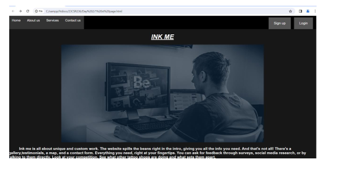
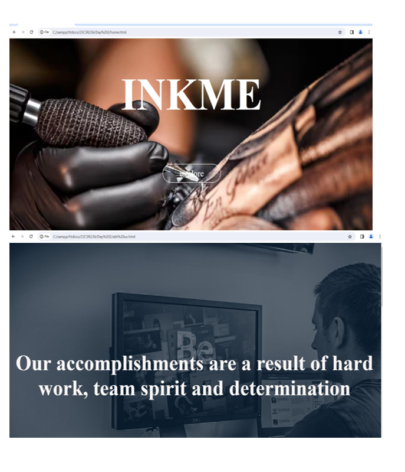
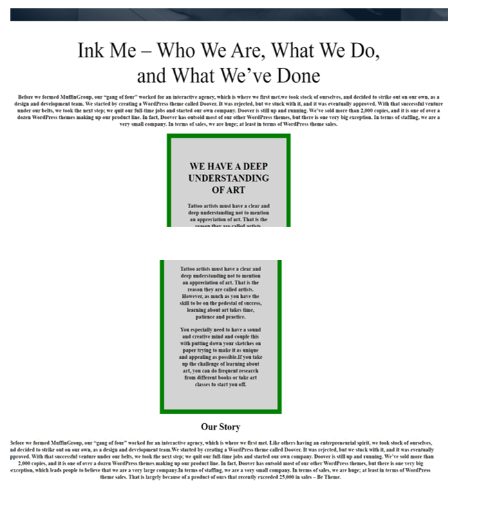
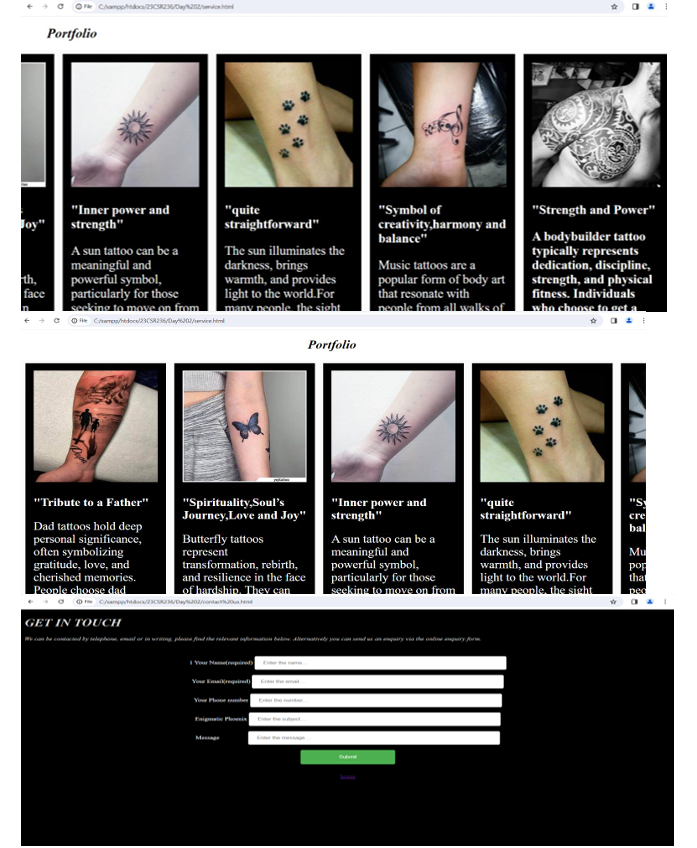
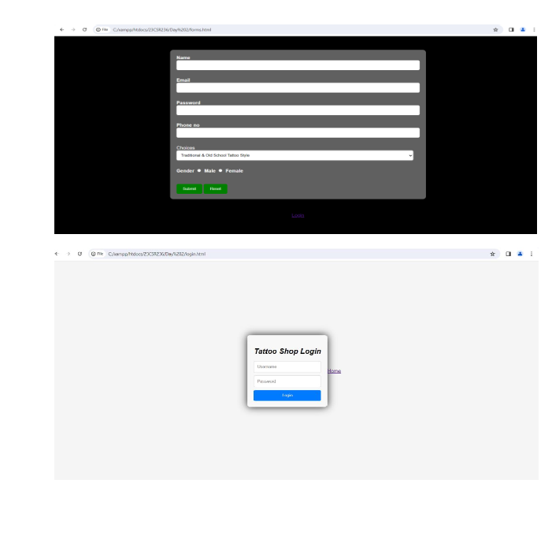

# A Webpage using CSS
**About our project**

Welcome to the Inked Essence Tattoo Studio GitHub repository! This project is dedicated to the development and maintenance of the official website for our tattoo studio. Here you’ll find the code, assets, and documentation necessary to understand and contribute to our website.

**About Us**

Inked Essence Tattoo Studio is a premier tattoo destination where artistry and craftsmanship come together. Our skilled artists specialize in creating custom tattoos that range from intricate designs to bold statements. Our studio provides a welcoming and professional environment to ensure a memorable tattoo experience for each client.

**Features**

Custom Tattoo Gallery: Showcases our artists' portfolios with a responsive grid layout.

Booking System: Allows clients to book appointments online with ease.

Contact Form: Provides an easy way for potential clients to get in touch with us.

Responsive Design: Optimized for viewing on both desktop and mobile devices.

